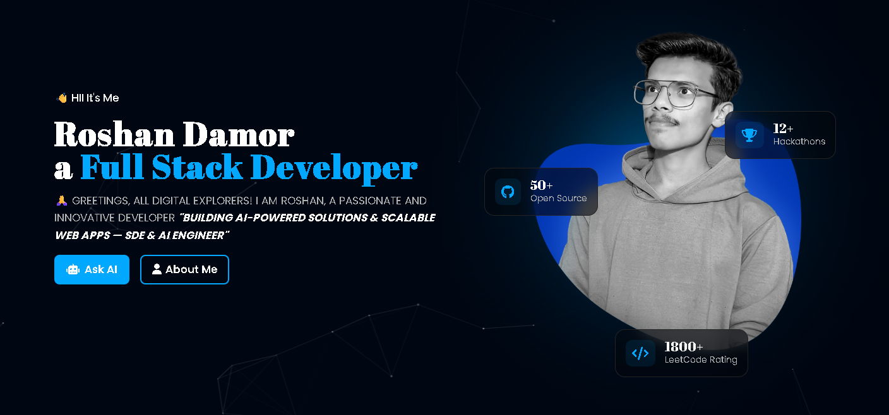
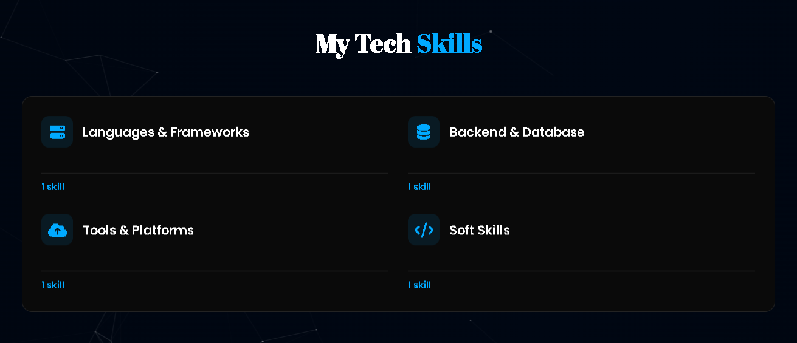
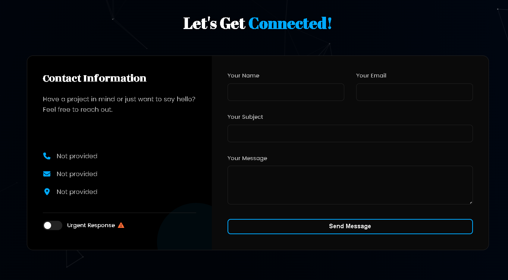

<div align="center">
  
</div>

<h1 align="center">🌐 DevMitra — Intelligent Portfolio Website</h1>
<p align="center">
  <b>A next-gen portfolio platform built with Django, MySQL, APIs, and creativity — to showcase projects, skills, experiences, and more in an interactive and intelligent way.</b>
</p>
<p align="center">
  🌍 <b>Live Demo:</b> <a href="https://roshandamor.me" target="_blank">https://roshandamor.me</a> | 
  📖 <b>Setup Guide:</b> <a href="./SETUP.md">SETUP.md</a>
</p>

<p align="center">
  <a href="https://github.com/logicbyroshan/portfolio-v2.0/stargazers">
    
  </a>
  <a href="https://github.com/logicbyroshan/portfolio-v2.0/network/members">
    
  </a>
  <a href="#">
    
  </a>
  <a href="#">
    
  </a>
  <a href="LICENSE">
    
  </a>
</p>

## 📸 Screenshots

<div align="center">
  <table>
    <tr>
      <td width="50%">
        
        <p align="center"><b>Hero Section</b></p>
      </td>
      <td width="50%">
        
        <p align="center"><b>Projects Section</b></p>
      </td>
    </tr>
    <tr>
      <td width="50%">
        
        <p align="center"><b>Skills Section</b></p>
      </td>
      <td width="50%">
        
        <p align="center"><b>Contact Section</b></p>
      </td>
    </tr>
  </table>
</div>

---

## ✨ About DevMitra
**DevMitra** is not just a portfolio — it’s a **personal platform**.  
It goes beyond static resumes by offering dynamic features like blogs, projects, music playlists, AI chatbot, achievements, resources, and even collaboration tools.  

This project reflects my **journey, creativity, and technical growth**.  
I built DevMitra to document my work, share my learnings, and provide visitors with an **interactive experience** instead of just static information.

---

## 🚀 Features

### ✅ Current Features
- 🖥 **Responsive UI** — Fully mobile-friendly, smooth animations, optimized CSS architecture
- 📂 **Projects & Experience** — Detail pages with filtering, sorting, and pagination  
- ✍️ **Blog System** — Dedicated blog app with commenting, categories, and rich content
- 🎵 **Music Integration** — Spotify API integration with playlist management
- 🏆 **Skills & Achievements** — Interactive showcase with detailed skill pages
- 📚 **Resources Hub** — Personal resources and downloadable materials (roshan app)
- 🤖 **AI Assistant** — Gemini API powered chatbot for portfolio queries
- ✉️ **Smart Notifications** — Email system with contact forms and confirmations
- 📄 **Resume Features** — PDF preview and video resume integration
- 🔒 **Authentication System** — Complete user management with secure login/signup
- 🎨 **Centralized CSS** — Consolidated animations, components, and responsive design  

### 🔮 Upcoming Features
- ✅ **ToDo App** (integrated mini-app).  
- ✅ **Project Manager & Blog Manager** (admin tools).  
- 🌍 **Dedicated Blog Website** with preferences, social login, AI suggestions.  
- 🛠 **Custom Admin Dashboard** to manage projects, blogs, resources, and notifications.  
- 🔗 **REST API Integration** across apps (portfolio + blog + community).  
- 💬 **Real-time Collaboration** (WebSockets for Code Together).  
- 🎮 **Gamified Blogs** — Reader badges & engagement tracking.  
- 👥 **User Profiles** — Social login, preferences, and personalization.  
- ⚡ **DevOps Ready** — Dockerization, CI/CD, and scalable deployment.  

---

## 📂 Project Structure

```bash
PORTFOLIO/
├── .github/            # GitHub workflows / CI
├── .vscode/            # VS Code workspace settings
├── ai/                 # AI assistant integration (Gemini API)
├── auth_app/           # Authentication system (signup, login, password reset)
├── blog/               # Blog application (articles, comments, categories)
├── config/             # Django project configuration & settings
├── logs/               # Application logs for debugging
├── media/              # User uploaded media files
├── music/              # Music playlists & Spotify API integration
├── notifications/      # Email notifications & messaging system
├── portfolio/          # Main portfolio app (projects, skills, experience)
├── roshan/             # Personal resources & additional content
├── screenshots/        # Project screenshots for documentation
├── static/             # Static files (CSS, JS, Images)
├── templates/          # HTML templates & base layouts
├── .env                # Environment variables (not in repo)
├── .gitignore          # Git ignore rules
├── db.sqlite3          # SQLite database (development)
├── manage.py           # Django management commands
├── requirements.txt    # Python dependencies
├── README.md           # Project documentation
└── SETUP.md            # Detailed setup instructions
```

---

## 🚀 Quick Start

Want to set up this project locally? Check out the detailed setup guide: **[SETUP.md](./SETUP.md)**

### Quick Setup Commands
```bash
git clone https://github.com/logicbyroshan/portfolio-v2.0.git
cd portfolio-v2.0
python -m venv venv
source venv/bin/activate  # On Windows: venv\Scripts\activate
pip install -r requirements.txt
python manage.py migrate
python manage.py runserver
```

🌐 **Access at:** http://127.0.0.1:8000/

### 2️⃣ Create & Activate Virtual Environment
```bash
python -m venv venv
# Windows
venv\Scriptsctivate
# macOS/Linux
source venv/bin/activate
```

### 3️⃣ Install Dependencies
```bash
pip install -r requirements.txt
```

### 4️⃣ Configure Environment Variables
Create a `.env` file:
```env
SECRET_KEY=your_secret_key
DEBUG=True
ALLOWED_HOSTS=127.0.0.1,localhost
EMAIL_HOST=smtp.gmail.com
EMAIL_PORT=587
EMAIL_HOST_USER=your_email
EMAIL_HOST_PASSWORD=your_password
```

### 5️⃣ Run Migrations
```bash
python manage.py migrate
```

### 6️⃣ Start Development Server
```bash
python manage.py runserver
```
Access at: **http://127.0.0.1:8000/**

---

## 🛠 Tech Stack

| Technology | Purpose |
|------------|---------|
| **Python 3.11+** | Programming language |
| **Django 5.2.5** | Backend framework |
| **MySQL / SQLite** | Database |
| **HTML5, CSS3, JS** | Frontend |
| **Redis** | Caching & async tasks |
| **Spotipy** | Spotify API integration |
| **Google Gemini API** | AI chatbot |
| **Django AllAuth** | Authentication & social login |
| **TinyMCE** | Rich text editor |
| **Whitenoise & Gunicorn** | Deployment |

---

## 📦 Key Dependencies

From [`requirements.txt`](./requirements.txt):

- `Django==5.2.5`  
- `django-allauth==65.4.0`  
- `django-cors-headers==4.8.0`  
- `django-tinymce==4.1.0`  
- `mysqlclient==2.2.7` / `PyMySQL==1.1.2`  
- `redis==6.4.0`  
- `spotipy==2.25.1`  
- `google-generativeai==0.8.5`  
- `google-ai-generativelanguage==0.6.15`  
- `gunicorn==23.0.0`  
- `whitenoise==6.10.0`  
- `python-dotenv==1.1.1`  
- `pillow==11.3.0`  

_(Full list available in `requirements.txt`.)_

---

## 🚀 Deployment Options
- **Render / Railway** — Easy cloud deployment.  
- **Dockerized Setup** — Coming soon.  
- **Custom VPS** with Nginx + Gunicorn + SSL.  

---

## 🎯 Recent Improvements

- ✅ **CSS Architecture Overhaul** — Consolidated 300+ lines of duplicate CSS into centralized components
- ✅ **Responsive Optimization** — Enhanced mobile experience with better spacing and typography
- ✅ **Blog System** — Completely separated blog functionality into dedicated Django app
- ✅ **Animation System** — Unified data-animation system across all pages
- ✅ **Component Consolidation** — Breadcrumbs, page headers, and grid layouts centralized in base.css
- ✅ **Performance Boost** — Reduced CSS bloat and improved maintainability

## 🤝 Contributing

Contributions are welcome! Whether it's bug fixes, new features, or improvements to the documentation.

**How to contribute:**
1. Fork the repository
2. Create a feature branch (`git checkout -b feature-name`)
3. Make your changes
4. Test thoroughly
5. Commit your changes (`git commit -m 'Add feature'`)
6. Push to the branch (`git push origin feature-name`)
7. Open a Pull Request  

---

## 📜 License
This project is licensed under the **MIT License** — see the [LICENSE](LICENSE) file for details.

---

> 💡 *Tip: Always keep your live demo link updated in this README to impress recruiters and collaborators instantly.*
